```mermaid 
graph TD
    %% Define Styles
    classDef process fill:#e0e7ff,stroke:#5c6bc0,stroke-width:2px;
    classDef data fill:#e8f5e9,stroke:#4caf50,stroke-width:2px,stroke-dasharray: 5 5;
    classDef artifact fill:#fffde7,stroke:#ffc107,stroke-width:2px;
    classDef choice fill:#fbe9e7,stroke:#ff5722,stroke-width:2px;

    %% STAGE 0: The Choice
    A{Use Synthetic or Real Data?};
    class A choice;

    A -- "Synthetic" --> P1[run generate_synthetic_data.py];
    A -- "Real CZI" --> P2[run download_from_czi.py];
    
    %% STAGE 1: Data Acquisition
    subgraph "1. Data Acquisition"
        direction LR
        P1; P2;
    end
    
    P1 --> D1[/Gene Expression Matrix/];
    P2 --> D1;

    %% STAGE 2: Model Training
    subgraph "2. Foundation Model Training"
        P3[run train_model.py];
    end

    D1 -- "Training Dataset" --> P3;
    P3 --> M1[📦 foundation_model.pth];
    class M1 artifact;

    %% STAGE 3: Evaluation
    subgraph "3. Evaluation & Insight Mining"
        P4[run evaluate_latent_space.py];
    end

    D1 -- "Test Dataset" --> P4;
    M1 -- "Trained Model" --> P4;

    P4 --> F1[📄 latent_umap.png];
    P4 --> F2[📄 metrics_report.csv];
    class F1,F2 artifact;

    %% Apply class styles
    class P1,P2,P3,P4 process;
    class D1 data;
```

# 🧬 ACHILLES: Foundation Model for Single-cell Spatial Multiomics IO Therapeutics Mapping


This project simulates high-dimensional single-cell and spatial omics data, building a foundational deep learning model to extract structured insights from noisy biological-like signals. It demonstrates applied AI/ML, deep learning, and statistical analysis in a genomic context—without requiring real biological datasets.


---


## 🚀 Overview


This repository features:


- **Synthetic data generation** for spatial single-cell transcriptomics  

- **Foundation model training** with PyTorch ([Autoencoder](training/train_model.py) / Transformer Encoder)  

- **Latent space embeddings** for clustering and mock ontological insights  

- **Therapeutics evaluation metrics** (e.g., ARI, NMI, Silhouette)  

- **Spatial ligand-receptor interaction mapping** 

- **Visualization** of latent space and clustering results using UMAP and PCA

- **Tissue classification** using latent embeddings and random forest classifier

- **Interactive notebooks** for data exploration and visualization

- **Data download scripts** for 10X Genomics and Vizgen MERSCOPE datasets


---

<<<<<<< HEAD


=======


---
>>>>>>> 1ae53dcf (git rebase --continueUpdated package)
## 🔧 Setup


Create environment:

```bash

conda create -n CytoImmunoMap python=3.11

conda activate CytoImmunoMap

```


Install dependencies:

```bash

pip install -r requirements.txt

```


---
---

🧪 10X Genomics Single-Cell and Spatial Data Download with download_10x.py
```bash
python download_10x.py --url https://cf.10xgenomics.com/samples/xenium/1.3.0/Xenium_Preview_Human_Non_diseased_Lung_With_Add_on_FFPE/Xenium_Preview_Human_Non_diseased_Lung_With_Add_on_FFPE_outs.zip --output data/Xenium_Preview_Human_Non_diseased_Lung_With_Add_on_FFPE_outs.zip
```

---


## 🧪 Running the Project


1. **Generate and Map Synthetic, Spatial, and Single-cell Omics Data**

    ```bash

    python 

    ```


2. **Train Foundation Model**

    ```bash

    python CytoImmunoMap/train_model.py

    ```


3. **Evaluate Latent Embeddings**

    ```bash

    python evaluation/evaluate_latent_space.py

    ```


Or open [`notebooks/`](notebooks/) to run interactively.


[](https://colab.research.google.com/github/danieljosephgomez/foundation-model-spatialomics/notebooks/01_visualize_hubmap_data.ipynb)


---


## 🧠 Key Concepts Demonstrated


| Skill                      | Implementation                             |

| -------------------------- | ------------------------------------------ |

| Python & ML Frameworks     | PyTorch models, training loop              |

| Applied Math & Statistics  | PCA, UMAP, clustering metrics              |

| Foundation Model Logic     | Latent space encoding & reuse              |

| Creative Problem-Solving   | Simulated ontologies + latent structure    |

| Scalability & Validation   | Train/test split, synthetic generalization |

| Collaboration & Modularity | Structured repo, clear API, doc-ready      |


---


## 📊 Example Outputs


- **spatial_ligand_map.png**: Spatial map of ligand expression across tissue  

- **spatial_receptor_map.png**: Spatial map of receptor expression across tissue  

- **interaction_matrix.csv**: Quantified ligand-receptor interaction matrix between cell types or regions  


---


## 📥 Data Download Scripts


- **10X Genomics Single-Cell and Spatial Data**  

    ```bash

    python download_10x.py --url https://cf.10xgenomics.com/samples/xenium/1.3.0/Xenium_Preview_Human_Non_diseased_Lung_With_Add_on_FFPE/Xenium_Preview_Human_Non_diseased_Lung_With_Add_on_FFPE_outs.zip --output data/Xenium_Preview_Human_Non_diseased_Lung_With_Add_on_FFPE_outs.zip

    ```


- **Vizgen MERSCOPE Spatial Multiomics Data**  

    ```bash

    python download_merscope.py --gcs-path gs://vz-ffpe-showcase/HumanUterineCancerPatient2-ROCostain/cell_by_gene.csv --output data/merscope/cell_by_gene.csv

    python download_merscope.py --gcs-path gs://vz-ffpe-showcase/HumanUterineCancerPatient2-ROCostain/cell_metadata.csv --output data/merscope/cell_metadata.csv

    ```

---


## 🧬 Tissue/Region Classification


Classify tissue or region using latent space embeddings and a random forest classifier:


```bash

python tissue_classification.py \

  --input_csv outputs/latent_with_umap_clusters.csv \

  --tissue_col Tissue \

  --output_report outputs/analysis/tissue_classification_report.csv

```


---


## 📜 License


MIT License

<<<<<<< HEAD


---


## 👤 Contact: Daniel J. Gomez  

[sfdanielgomez@gmail.com](mailto:sfdanielgomez@gmail.com) 
=======
👤 Author
Daniel J. Gomez
[sfdanielgomez@gmail.com | https://www.linkedin.com/in/danieljgomez1]
>>>>>>> 1ae53dcf (git rebase --continueUpdated package)
